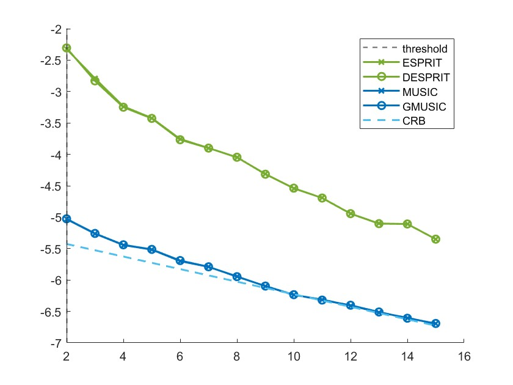
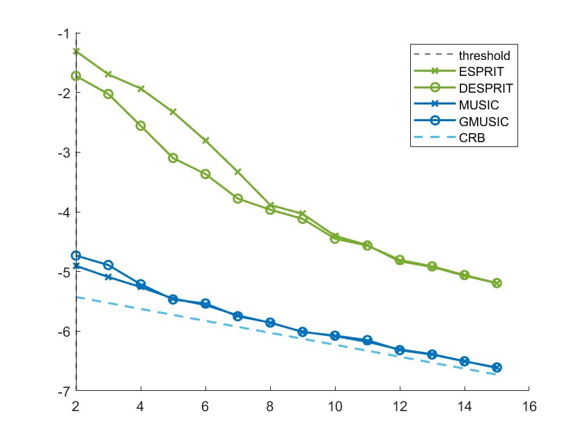

# 2023-12-19

**实验1** ：在不相关widely spaced DoA 情况下，ESPRIT GESPRIT MUSIC GMUSIC CRB 的曲线($N = 80,T =160$  SNR $=0$)

此时GESPRI\ ESPRIT一致 MUSIC 和GMUSIC仍然保持一致

---

**实验2** ：在相关widely spaced DoA 情况下，ESPRIT GESPRIT MUSIC GMUSIC CRB 的曲线($N = 80,T =160$ Speration condition SNR $=0$)

此时GESPRI算法应该优于ESPRIT算法  MUSIC 和GMUSIC保持一致  

---

**实验3** ：验证N,T增大特征值和特征值的极限的谱范数距离（还有N、T较大的单独实验）
