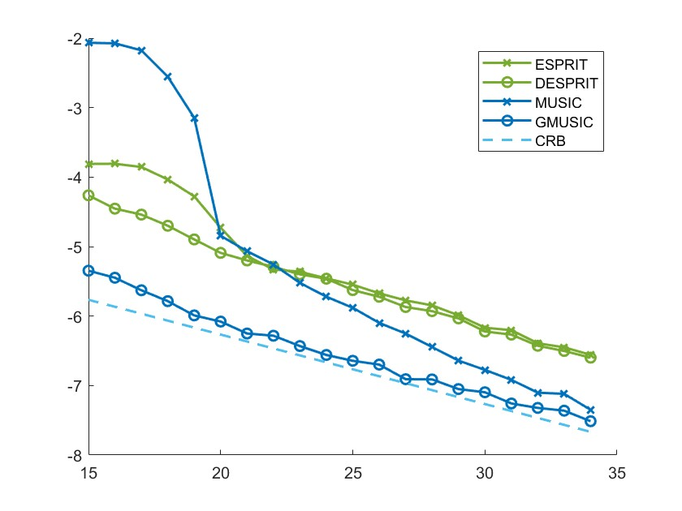
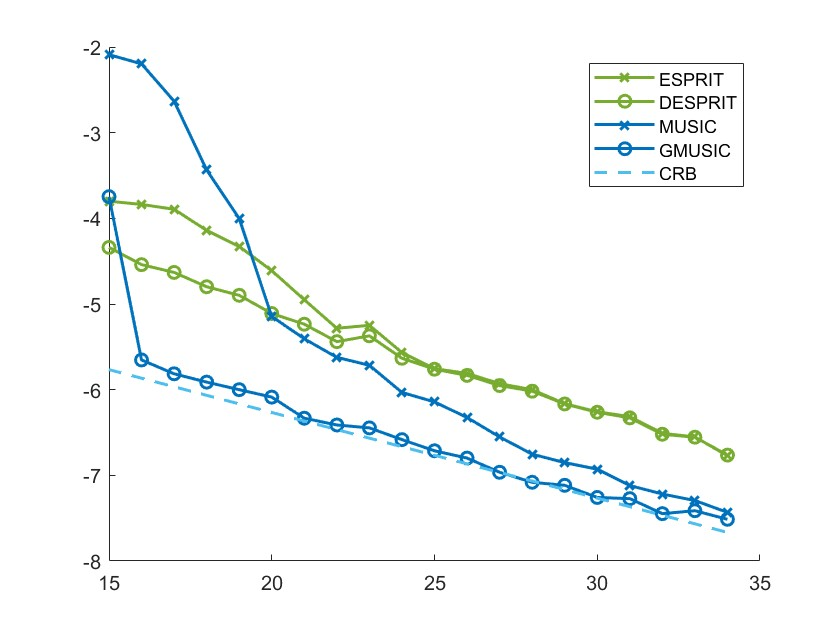

# 2023-12-19

**实验1** ：在不相关widely spaced DoA 情况下，ESPRIT GESPRIT MUSIC GMUSIC CRB 的曲线($N = 80,T =160$  SNR $=0$)

此时GESPRI\ ESPRIT一致 MUSIC 和GMUSIC仍然保持一致

---

**实验2** ：在相关widely spaced DoA 情况下，ESPRIT GESPRIT MUSIC GMUSIC CRB 的曲线($N = 80,T =160$ Speration condition SNR $=0$)

此时GESPRI算法应该优于ESPRIT算法  MUSIC 和GMUSIC保持一致  

---

**实验3** ：验证N,T增大特征值和特征值的极限的谱范数距离（还有N、T较大的单独实验） 期望和方差  
3.1 先跑SNR=2的情况下的特征值极限值和理论值  
    
    theta_true = [0,pi/3];  
    coeff =10;  
    N = 40 * coeff;  
    T = 80 * coeff;  

3.2 $E[\hat{\theta} - \theta] , Var[\hat{\theta} - \theta]$

---
**实验4** ：ESPRIT方法与子阵列的取值数量的关系 考虑在不同的子阵列下  
貌似阵列取少后会出现 在pi/ pi 相位模糊的情况

---

**实验5** ：
在相关closely spaced DoA 相关信号情况下，ESPRIT GESPRIT MUSIC GMUSIC CRB 的曲线($N = 80,T =160$ Speration condition SNR $=0$)
  
在相关closely spaced DoA 不相关信号情况下，ESPRIT GESPRIT MUSIC GMUSIC CRB 的曲线($N = 80,T =160$ Speration condition SNR $=0$)

---

**Quesitons**
* Q2 : 重根条件下无法算，但是结果表明没有问题，实际上可以忽略重根影响
* Q3 ：当不满足分离条件的时候，舍弃特征值还是不修复