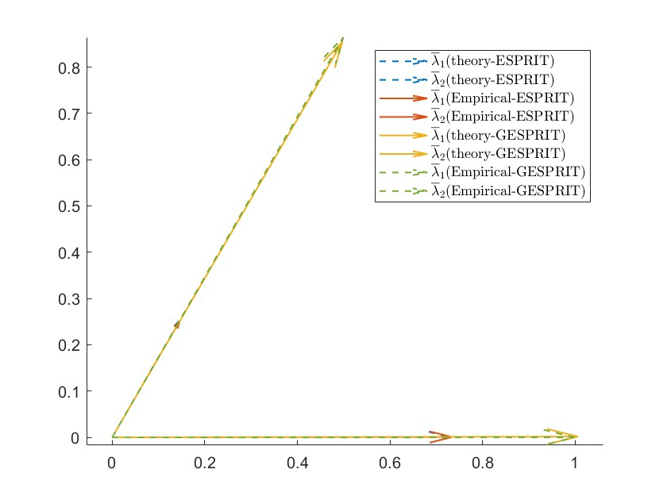
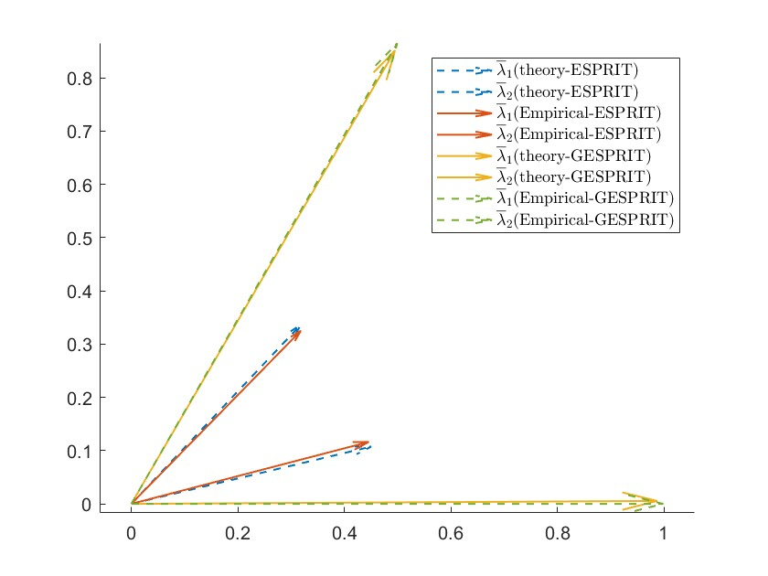
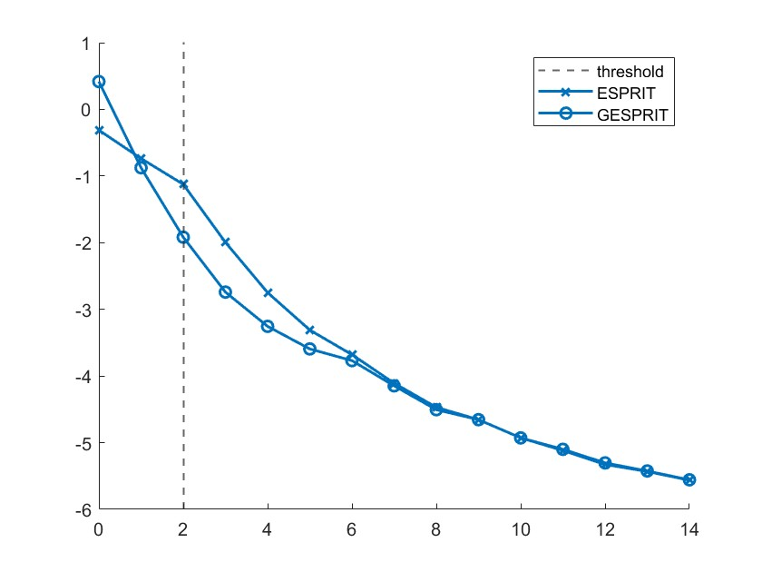
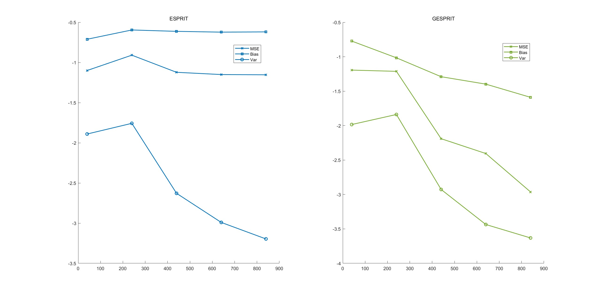

## 2023-12-7 探究非对角高斯情况下的特征值的极限

Pnodiagonal 为探究非对角时，特征值的极限，Figure1 为结果，随着信噪比的增大，渐进特征值逐渐收敛于真实角度（但不是渐进）

<table >
    <tr>
        <th> SNR = 2</th>
        <th> SNR = 4</th>
        <th> SNR = 6</th>
    </tr>
    <tr>
        <td >
 
</td>
        <td >
 
</td>
        <td >
 
</td>
    </tr>
    <tr>
        <td >
 
</td>
        <td >
 
</td>
        <td >
 
</td>
    </tr>
</table>

---

## 2023-12-11 探究只修复对角线元素后特征值的极限（并与上述情况比较）
error Pnodiagonal_12_11.m

## 探究特征值的极限是否收敛于给定角度，重复实验100次
Pnodiagonal_12_11.m	
change
1. 验证$\lambda_i \rightarrow \overline{\lambda}_i$  
    1.1 Setting :   $P = \begin{pmatrix}1 & 0 \\ 0 & 1 \end{pmatrix}$,SNR = 2dB,$N = 800,T = 1600$  
    1.2 Setting :   $P = \begin{pmatrix}1 & 0.4 \\ 0.4 & 1 \end{pmatrix}$,SNR = 2dB,$N = 800,T = 1600$  
    1.3 Setting :   $P = \begin{pmatrix}1 & 0.4 \\ 0.4 & 1 \end{pmatrix}$,SNR = 3dB,$N = 800,T = 1600$  
    1.4 Setting :   $P = \begin{pmatrix}1 & 0.4 \\ 0.4 & 1 \end{pmatrix}$,SNR = 4dB,$N = 800,T = 1600$  

Setting 1.1
 

 

<table >
    <tr>
        <th> setting  1.2</th>
        <th> setting  1.3</th>
        <th> setting  1.4</th>
    </tr>
    <tr>
        <td >
 
</td>
        <td >
 
</td>
        <td >
 
</td>
    </tr>
</table>

## 2023-12-12（未作）
* 仿真重根情况下，特征值的极限是否一致
* 仿真ESPRIT 方法的Var Bias 曲线 在相关信号下

## 2023-12-14
Pnodiagonal_12_14.m
* 仿真G-ESPRIT 考虑修复对角线和非对角线 保证---(seem right)
* 仿真G-ESPRIT ESPRIT 随着SNR增加的性能曲线
* 仿真G- 的bias var  SNR=2 

重根条件下无法解决这些问题

需要画的图：  (Figure 3)
1. 不相关情况下ESPRIT算法的极限SNR = 2 （Pnodiagonal_12_14_1）

    在相关情况下，ESPRIT,GESPRIT算法能够获得渐进一致估计，两者表现一致
2. 原始ESPRIT算法的特征值极限（有偏），改进（无偏）SNR = 2dB 超过了阈值条件（Pnodiagonal_12_14_1.m）

    在不相关的情况下，ESPRIT算法不在是一致估计，而GESPRIT算法仍然是一致估计

3. ESPRIT算法GESPRIT算法的MSE 比较 随着SNR  （Pnodiagonal_12_14_2.m）

    在超过threhold 时候 GESPRIT 优于ESPRIT 随着SNR增大 两者吻合

4. SNR =2 时 ESPRIT 算法和GMUSIC的bias 和var（Pnodiagonal_12_14_3.m）

    ESPIT失去一致性 而GESPIT保持一致 性
    

