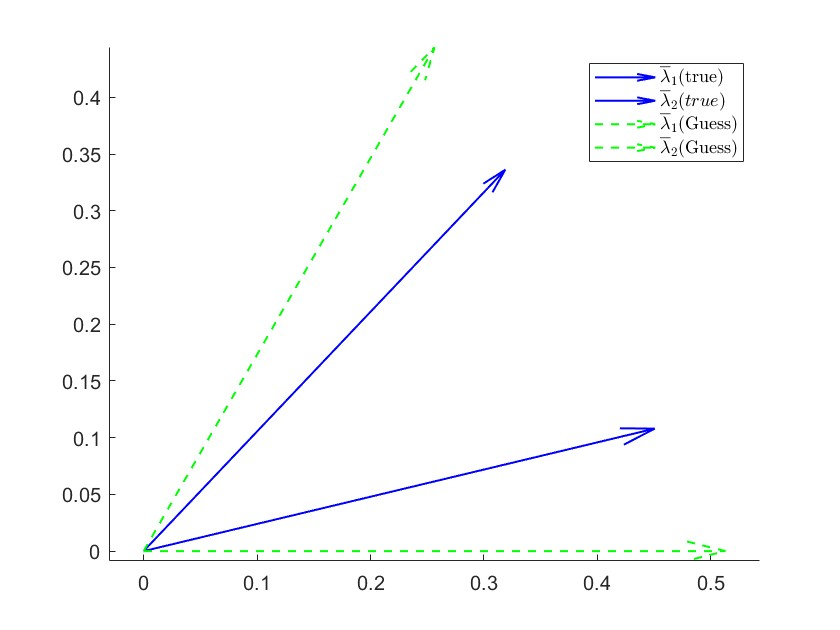
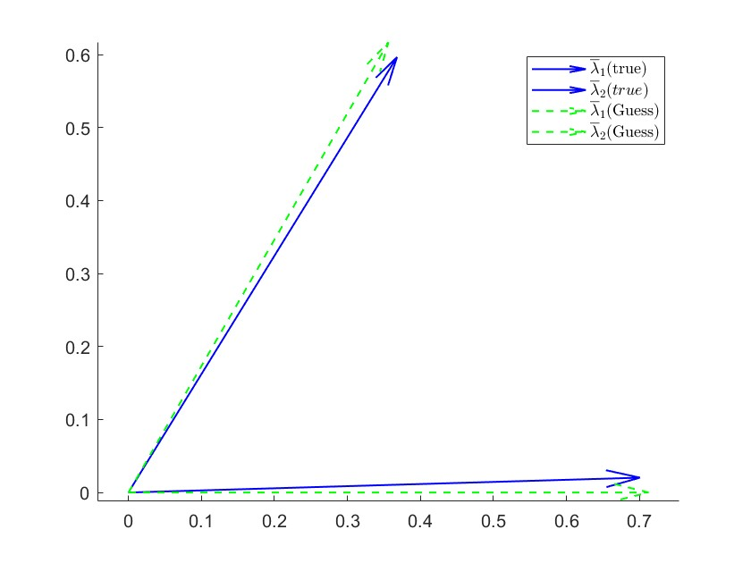
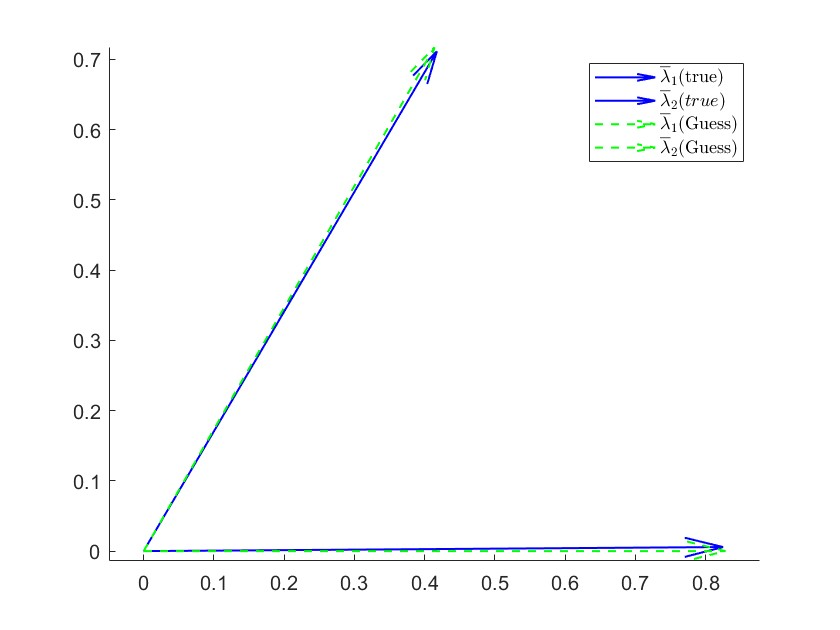
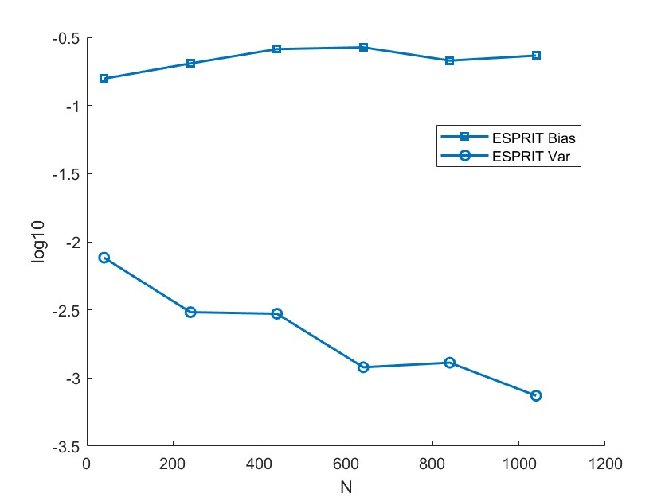
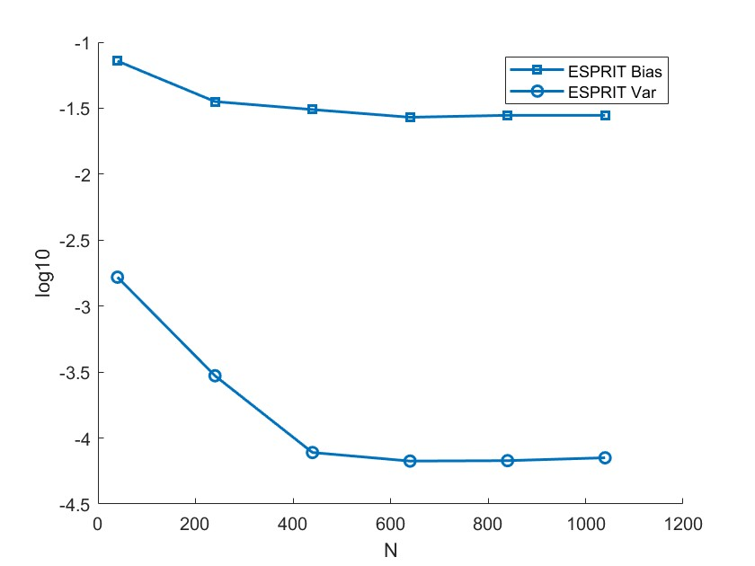
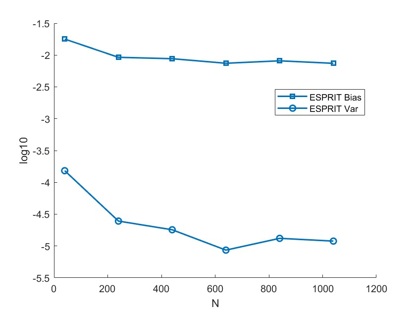
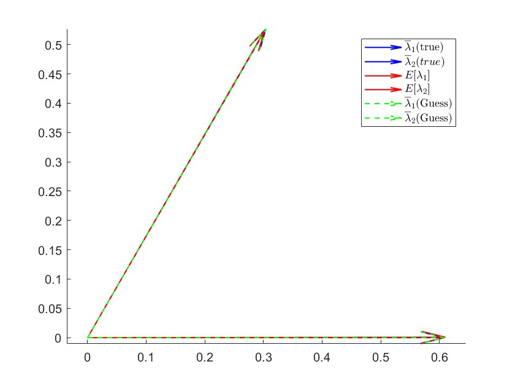
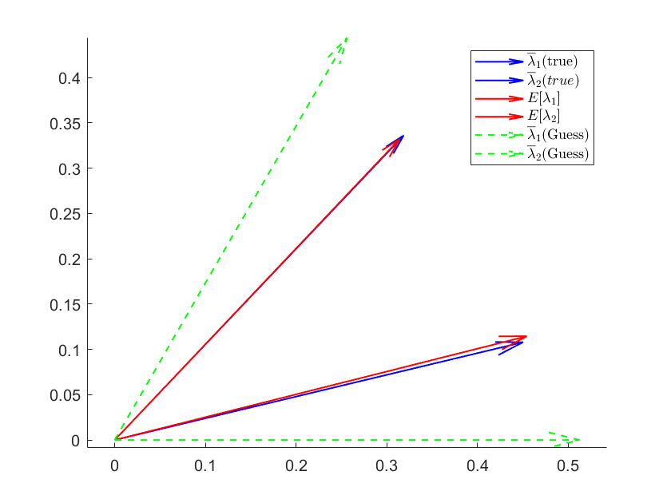
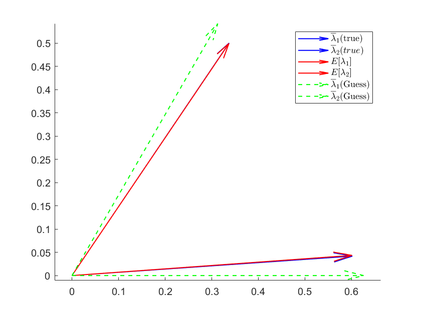
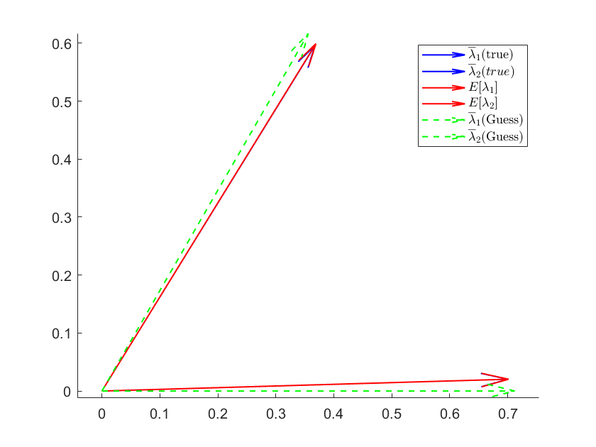

## 2023-12-7 探究非对角高斯情况下的特征值的极限

Pnodiagonal 为探究非对角时，特征值的极限，Figure1 为结果，随着信噪比的增大，渐进特征值逐渐收敛于真实角度（但不是渐进）

<table >
    <tr>
        <th> SNR = 2</th>
        <th> SNR = 4</th>
        <th> SNR = 6</th>
    </tr>
    <tr>
        <td >
 
</td>
        <td >
 
</td>
        <td >
 
</td>
    </tr>
    <tr>
        <td >
 
</td>
        <td >
 
</td>
        <td >
 
</td>
    </tr>
</table>

---

## 2023-12-11 探究只修复对角线元素后特征值的极限（并与上述情况比较）
error Pnodiagonal_12_11.m

## 探究特征值的极限是否收敛于给定角度，重复实验100次
Pnodiagonal_12_11.m	
change
1. 验证$\lambda_i \rightarrow \overline{\lambda}_i$  
    1.1 Setting :   $P = \begin{pmatrix}1 & 0 \\ 0 & 1 \end{pmatrix}$,SNR = 2dB,$N = 800,T = 1600$  
    1.2 Setting :   $P = \begin{pmatrix}1 & 0.4 \\ 0.4 & 1 \end{pmatrix}$,SNR = 2dB,$N = 800,T = 1600$  
    1.3 Setting :   $P = \begin{pmatrix}1 & 0.4 \\ 0.4 & 1 \end{pmatrix}$,SNR = 3dB,$N = 800,T = 1600$  
    1.4 Setting :   $P = \begin{pmatrix}1 & 0.4 \\ 0.4 & 1 \end{pmatrix}$,SNR = 4dB,$N = 800,T = 1600$  

Setting 1.1
 

 

<table >
    <tr>
        <th> setting  1.2</th>
        <th> setting  1.3</th>
        <th> setting  1.4</th>
    </tr>
    <tr>
        <td >
 
</td>
        <td >
 
</td>
        <td >
 
</td>
    </tr>
</table>

